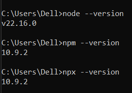

# How to install Node.JS
Answer:-  Follow this link " https://youtu.be/cvoLc3deAdQ?si=ipPq_5O4skg75rSu "
Step-1 :- Search on Google Node.js  or click on this link " https://nodejs.org/en/download" 
Step-2 :- As per the laptop operating System like Window, Mac, Linux download the current Version. 
Step-3 :- Download the Node.js after that click on node.js those you download.
Step-4 :- You click on next and choose the "i agree the license". after that download is complete.
Step-5 :- Press Window+R, Then Write the "CMD". 
Step-6 :- CMD is open in CMD write the three thing. If the version is not show properly then some issue will present.
          If the  version show properly then issue is not present. 
          The Three things are  node --version, npm --version, npx --version.
         
