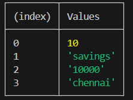

# Variable
It is divided into 4 types.
a) let
b) const (constant, those value you define once this value cannot be change)
c) var
d) automatic

Example of let :- let accountName="savings";
                  console.log(accountName);  //Output :- 10

Example of const :- const accountId=10;
                    console.log(accountId); // Output :- savings

Example of var :-  var accountBalance="10000";
                   console.log(accountBalance); // Output :- 10000

Example of automatic :- accountcity="chennai";
                        console.log(accountcity); // Output :- chennai

# Const :- 
Const means constant . Constant variable means those variable you define once by the help of const. this value can not be change.
Ex:- const r="ras"
    console.log(r)  //output :- ras 

# var :- 
It is the way of declare the varable. 
Why not USe The var ?
 some issue is present in the var.The issue is scope.Scope means {}. If i declare the variable one place and same name variable in another place again same name variable in another place. The var is doing like all the value changed. This thing solve in let. This thing for not use the var.

# Let :- 
It is the way declare the avriable. The scope issue is solved in let.

# Automatic :- 
It means if you declare the variable without using const or let. Then Javascript automatically take the variable. But it is bad.

# The Way of Print
const accountId=10;
let accountName="savings";
console.log(accountId);
console.log(accountName);   
console.table([accountId,accountName,accountBalance,accountcity]); // This table through value show in table format like 

# How to use comment :- 
First Option :- //
Second Option :- /* */

# Note :- 
If we decalre the variable but not giving the value then js print undefined. 
Example :- 
let state;
console.log(state) // output:- undefined